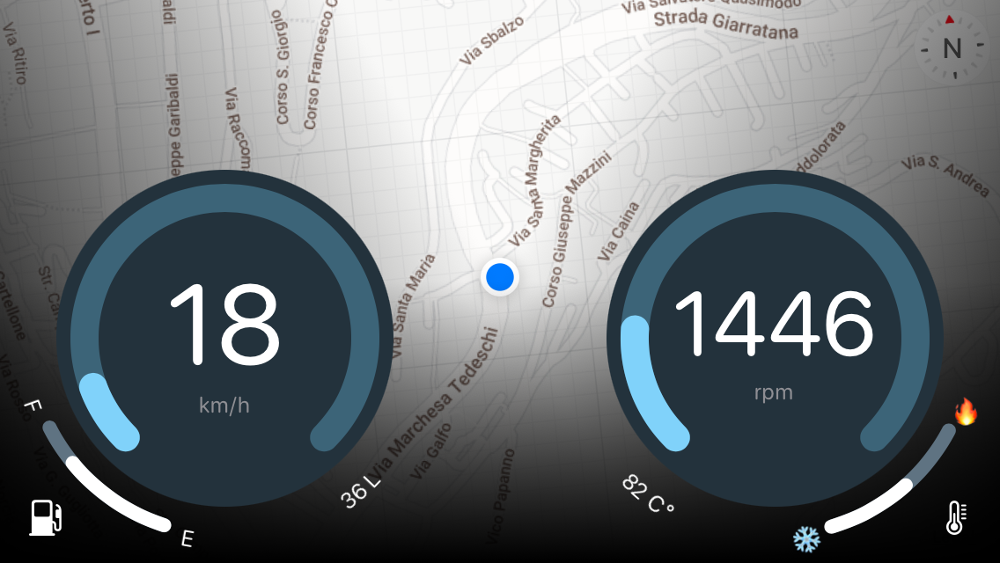

# Iron Mini
A stupid thing I made for my car (a Mini One D R50). Reads the data from the CAN bus and display speed, rpm, fuel level and coolant temperature.

## How to use
 * Upload `Captain_Americar` sketch to an Arduino board (I used an Arduino Mega + Ethernet shield + MCP2515 module)
 * Install Iron Mini app on an iPhone (with static ip 192.168.1.200 or update the sketch with another ip)
 * Put a modem in your car and connect both device (no internet needed).

Yes, you read that correctly, a freaking modem! Just remember to turn everything off or the car won't start next time 😉.

 
 
### Offline maps tiles
I know I shouldn't download Google Maps tiles, but hey, for personal use nobody cares.
Use(?) `Iron Mini/Iron Mini/Tiles/download.sh` to download tiles for your region and `Iron Mini/Iron Mini/Tiles/TilesToSQLiteBlob.playground` to move them to a SQLite db.

### Things to fix
* Sometimes the connection is delayed.
* The speed is ~(±4%) off.
